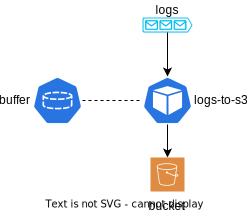

# terraform-module-k8s-fluentd-logs-archiver

Reads logs fom a Kafka topic and stores them in a S3 bucket

## How it works

<!-- BEGINNING OF PRE-COMMIT-TERRAFORM DOCS HOOK -->
## Requirements

No requirements.

## Providers

| Name | Version |
|------|---------|
|  [kubernetes](#provider\_kubernetes) | n/a |

## Modules

No modules.

## Resources

| Name | Type |
|------|------|
| [kubernetes_config_map.configmap](https://registry.terraform.io/providers/hashicorp/kubernetes/latest/docs/resources/config_map) | resource |
| [kubernetes_deployment.fluentd-kafka-s3-archiver](https://registry.terraform.io/providers/hashicorp/kubernetes/latest/docs/resources/deployment) | resource |
| [kubernetes_persistent_volume_claim.buffer](https://registry.terraform.io/providers/hashicorp/kubernetes/latest/docs/resources/persistent_volume_claim) | resource |

## Inputs

| Name | Description | Type | Default | Required |
|------|-------------|------|---------|:--------:|
|  [access\_key](#input\_access\_key) | #################################################### S3 | `string` | n/a | yes |
|  [broker\_servers](#input\_broker\_servers) | host:port, | `string` | n/a | yes |
|  [bucket\_name](#input\_bucket\_name) | n/a | `string` | n/a | yes |
|  [chunk\_limit\_size](#input\_chunk\_limit\_size) | The maximum size of each chunk | `string` | `"256m"` | no |
|  [consumer\_group](#input\_consumer\_group) | The key used to consumer using several archivers in parallel | `string` | n/a | yes |
|  [endpoint](#input\_endpoint) | n/a | `string` | n/a | yes |
|  [image](#input\_image) | Container image providing fluentd with kafka et s3 support | `string` | `"ghcr.io/mgrzybek/fluentd-kafka-s3-logs-archiver:main"` | no |
|  [name](#input\_name) | Name and prefix of the created objects | `string` | n/a | yes |
|  [namespace](#input\_namespace) | The namespace used to install bucket | `string` | n/a | yes |
|  [path](#input\_path) | #################################################### Buffer | `string` | `"/var/log/td-agent/s3"` | no |
|  [pvc\_buffer\_size](#input\_pvc\_buffer\_size) | Size of the volume provided to fluentd's buffer | `string` | `"5Gi"` | no |
|  [region](#input\_region) | n/a | `string` | n/a | yes |
|  [secret\_key](#input\_secret\_key) | n/a | `string` | n/a | yes |
|  [start\_from\_beginning](#input\_start\_from\_beginning) | ruby-kafka consumer option | `bool` | `true` | no |
|  [time\_slice\_format](#input\_time\_slice\_format) | Timestamp added to each object | `string` | `"%Y-%m-%d-%H-%M"` | no |
|  [timekey](#input\_timekey) | Flush the accumulated chunks every n minutes | `string` | `"60m"` | no |
|  [timekey\_use\_utc](#input\_timekey\_use\_utc) | Use UTC timestamps | `bool` | `true` | no |
|  [timekey\_wait](#input\_timekey\_wait) | Wait n minutes before flushing | `string` | `"1m"` | no |
|  [topics](#input\_topics) | A list a topics to read from | `list(string)` | n/a | yes |
|  [verify\_peer](#input\_verify\_peer) | Check certificate | `bool` | `true` | no |

## Outputs

No outputs.
<!-- END OF PRE-COMMIT-TERRAFORM DOCS HOOK -->
